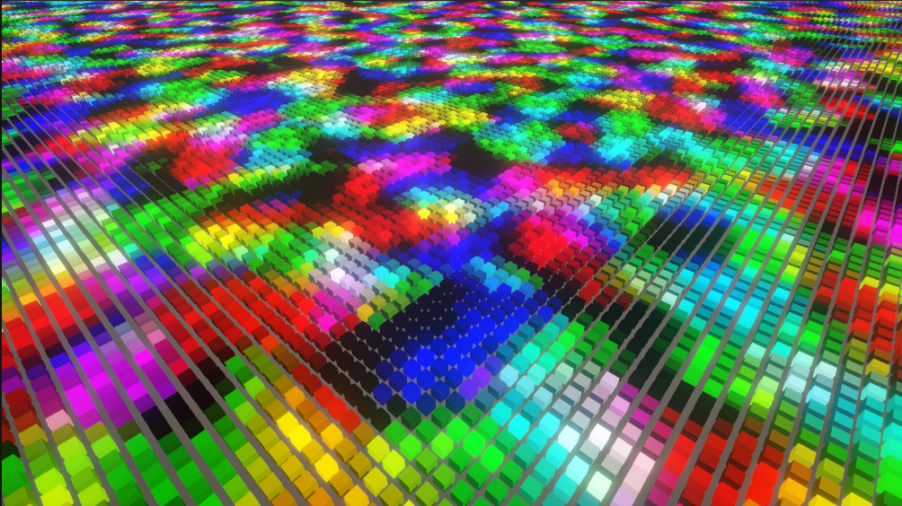

#  Rendering 100,000 Voxels with URP ShaderGraph (Unity3D)

I am trying to figure out the best way of rendering my voxel game engine. I want to handle a large amount of voxels so the engine can handle cool voxel projects, mobs, structures, vegetation, etc.

This method uses Unity Universal Render Pipeline to mesh instance a large amount of voxels onto the screen. Each voxel is then updated every frame before being rendered. Each voxel stores its transform, color and emission. This seems to be a promising system but does not beat the looks of the path tracing approach that I attempted here: (https://www.youtube.com/watch?v=vmOfpUK6mK8)

Special thanks to the following YouTuber for showing how to convert Shader Graph to handle Mesh Instancing:

"Render 1 Million Objects with Shader Graph and Unity" - KDSBest GameDev (https://www.youtube.com/watch?v=bny9f4zw5JE&t=0s)

YouTube Video: https://youtu.be/N_YBVycnxvY

 